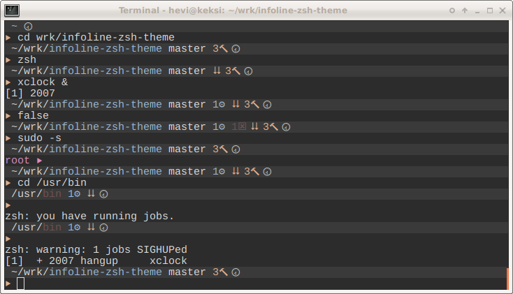

# Infoline zsh prompt theme




## Features

* Show host if in remote (ssh) computer
* Show Current Working directory
  * show cwd, trunkated from start if not enough room
  * Current dir part as green if can write, red if not
  * Number of files in current dir
* Show git status if exists
  * Repo dirty
  * Untracked files
  * Repo ahead, behind or diverged from upstream. Missing upstream.
* Show python virtual env
* Show number of files in current directory with color: ok - all writable
  focus - some not writable, error - none writable
* Show number of directories in current dircetory with color:
  ok - all writable, focus - some not writable, error - none writable
* 🕱 Program return code if error
* ⚙ Number of spawned jobs from shell
* ⮇ Shell level indicator
* 🖸 Disk usage alert if over 80% capacity
* 🖫 Virtual memory usage alert if over 80% capacity

## Install
Install theme as symlink to oh my zsh $ZSH/themes
```shell
> cd ~/src   # or wherever you like to collect local git repositories
> git clone https://github.com/hevi9/infoline-zsh-theme.git
> cd infoline-zsh-theme
> make install-omz
```

Install to use directly in .zshrc
  * make install instead make install-omz
  * Edit infoline.zsh-theme contents into your .zshrc


## Requirements
  * 256 color and unicode terminal
  * zsh
  * oh my zsh - https://github.com/robbyrussell/oh-my-zsh
  * Python 3.4+, pip and dependencies via pip install:
    * psutils
    * gitpython


## Notes
 * This prompt uses python for more complex and convient programmnig than shell,
   therefore process startup cost is higher. Prompt execution takes usually
   130ms.
 * Set export VIRTUAL_ENV_DISABLE_PROMPT=yes
 * Set export DEBUG_PROMPT=1 to show debug log on prompt making

## Todos
 * bash support, after bash unicode and non-printable wrap issues are resolved
 * git detached head
 * git conflicted files
 * git stashes
 * Sign for virtual env
 * todos in current directory info
