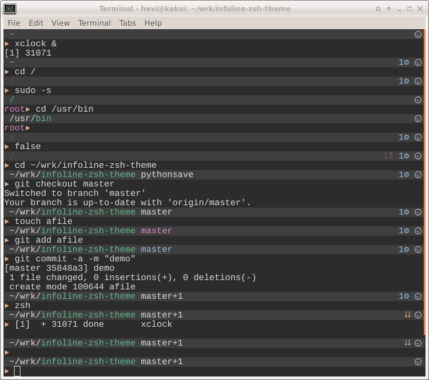

# Infoline zsh prompt theme



## Features

* Show host if in remote (ssh) computer
* Show Current Working directory
  * Current dir part as green if can write, red if not
* Show git status if exists (and others via zsh vcs_info)
  * Branch name with color: purple for untracked files, yellow for unstaged files
    and blue for staged files
  * Repo N⭱ ahead or N⭳ behind.
  * Merge ⭾ etc action state (via vcs_info)
* N🕱 Program return code if error
* N⚙ Number of spawned jobs from shell
* ⮇ Shell level indicator
* NN🖸 Disk usage alert if over 80% capacity
* 🕦 Analog clock (within 30m resolution)
* ▶ Start arrow with color and name if not login user

## Install Instructions

### Installing manually to use directly in `.zshrc` without a Framework

Git clone
```shell
> cd ~/src   # or wherever you like to collect local git repositories
> git clone https://github.com/hevi9/infoline-zsh-theme.git
```
Edit .zshrc
```shell
source $HOME/src/infoline-zsh-theme/infoline.zsh-theme
```

### Oh-My-Zsh

Clone as manually. Link theme into [oh my zsh](https://github.com/robbyrussell/oh-my-zsh)
themes (or your ZSH_CUSTOM)
```shell
ln -sf ~/src/infoline-zsh-theme/infoline.zsh-theme ~/.oh-my-zsh/themes/infoline.zsh-theme
```
Edit .zshrc
```
ZSH_THEME="infoline"
```

### Antigen

Add `antigen bundle hevi9/infoline-zsh-theme` to your `.zshrc` file. [Antigen](https://github.com/zsh-users/antigen) will handle cloning the plugin for you automatically the next time you start zsh. You can also add the plugin to a running zsh with `antigen bundle hevi9/infoline-zsh-theme` for testing before adding it to your `.zshrc`.

### Zgen

Add `zgen load hevi9/infoline-zsh-theme` to your `.zshrc` file in the same function you're doing your other `zgen load` calls in. [Zgen](https://github.com/tarjoilija/zgen) will automatically clone the repository for you when you do a `zgen save`.

## Requirements
  * 256 color and unicode terminal
  * [zsh](http://www.zsh.org/) as your login shell

## Configuration

No configuration yet. Good to go as it is. Configurations will be added as
need basis.

## Notes
  * This prompt theme had python implementation, but it was too slow: 120ms to
    350ms for prompt use. User experience was sluggish and slowness interfere completion
    with slow redraw of prompt. If interested about python implementation see
    pythonsave branch.

## Todos, Enchantments, Bugs, Issues ..

https://github.com/hevi9/infoline-zsh-theme/issues
